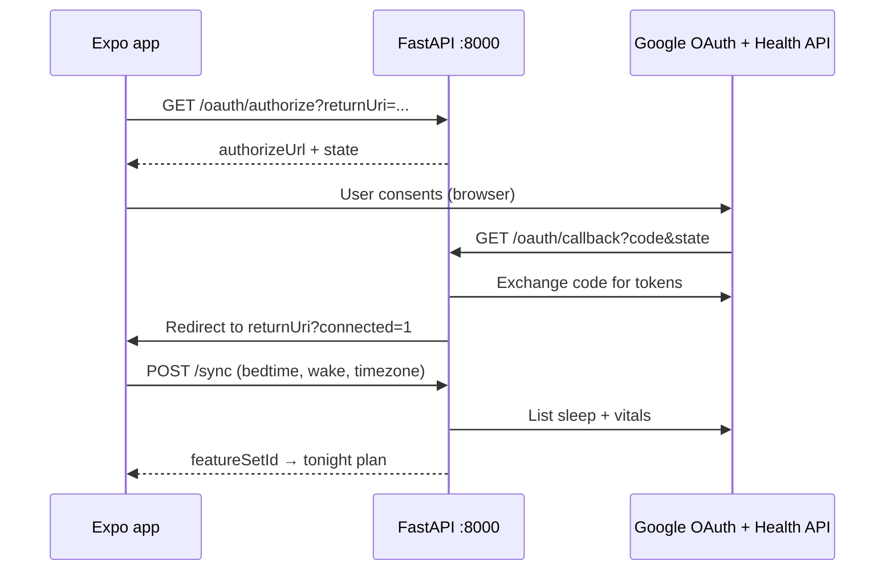

# Google Health (live sleep data)

SleepSync pulls **sleep stages**, **heart rate**, and **HRV** from the [Google Health API](https://developers.google.com/health) (Fitbit-backed) after the user connects Google Health in the app. The mobile app never sees your OAuth client secret; the backend stores encrypted refresh tokens in SQLite.

**Connect Google Health** needs `GOOGLE_OAUTH_CLIENT_ID` and `GOOGLE_OAUTH_CLIENT_SECRET` in `backend/.env`. Without them, authorize returns **503** and tonight's plan uses the **mock sleep week** only.

## Architecture



| URI | Registered in Google Cloud? | Purpose |
|-----|----------------------------|---------|
| `GOOGLE_HEALTH_REDIRECT_URI` (backend `/v1/google-health/oauth/callback`) | **Yes** — must match exactly | Google redirects here after consent |
| App `returnUri` (e.g. `sleepsync://…` or `http://localhost:8081/…`) | No | Backend redirects here after token exchange |

## 1. Google Cloud project

1. Open [Google Health API setup](https://developers.google.com/health/setup) and use **Enable the API and get an OAuth 2.0 Client ID** (or enable **Google Health API** manually under APIs & Services).
2. Create an OAuth client: type **Web application** (web server flow; secrets stay on the backend).
3. Under **Authorized redirect URIs**, add your backend callback (see [Local dev](#2-local-dev) or [Hosted API](#3-hosted-api)).
4. **Audience → Test users**: add every Google account that will connect (required while the app is in *Testing*; max 100 users).
5. **Data access**: add scopes (must match `backend/config.yaml`):
   - `https://www.googleapis.com/auth/googlehealth.sleep.readonly`
   - `https://www.googleapis.com/auth/googlehealth.health_metrics_and_measurements.readonly`
6. Copy **Client ID** and **Client secret**.

The connecting user needs **staged sleep in Google Health** (e.g. Fitbit worn overnight and synced). If sync returns too little data, the plan uses the **shared mock sleep week** until enough real nights are stored; the app says **mock sleep data** in the hero line.

## Personalization paths

| Path | When | Plan sleep signal |
|------|------|-------------------|
| **Google Health** | Connected + sync returns **sufficient** staged sleep | Mean of up to 7 stored `google_health` nights |
| **Mock sleep week** | Not connected, sync failed, or insufficient data | Shared fixtures in `backend/fixtures/mock_sleep_week/` |

Debrief history (last 7 mornings) always adjusts the curve on the server. Google sync uses **device wall clock** for the API window, not dev time scrub.

**Sufficiency:** at least 40% of bins with real stages and ≥180 minutes of staged sleep in the pulled window. Insufficient sync returns HTTP **422** and does not add a feature row.

The app UI uses `metadata.sleepDataReason` via `mobile/utils/planCopy.ts` (`using_google`, `insufficient_data`, `not_connected`, mock sleep data copy).

**Disconnect:** `DELETE /v1/google-health/connection` revokes tokens and removes the SQLite row. Mobile clears the cached plan, refreshes status, and refetches tonight's plan.

---

## Scopes (only these two)

SleepSync reads sleep stages plus heart rate / HRV. Configure **exactly** these on **Data access** (and they must match `backend/config.yaml`):

| Scope URL | What it allows |
|-----------|----------------|
| `https://www.googleapis.com/auth/googlehealth.sleep.readonly` | Read sleep sessions / stages |
| `https://www.googleapis.com/auth/googlehealth.health_metrics_and_measurements.readonly` | Read HR, HRV, etc. |

Do **not** add write scopes, profile, or extra APIs unless you need them — each scope can slow OAuth verification.

---

## Process: unlimited users with **real** Google Health data

Google controls who may consent. SleepSync code is already done; you complete Console + hosting steps.

### Phase 1 — Project + client (you are here)

1. [Enable Google Health API](https://developers.google.com/health/setup) on a Cloud project.
2. **Credentials** → OAuth client, type **Web application**.
3. **Authorized redirect URI** = your public API callback, e.g.  
   `https://api.yourdomain.com/v1/google-health/oauth/callback`  
   (use ngrok HTTPS for rehearsals; production needs a stable host).
4. **Data access** → add the two scopes above → **Save**.
5. **OAuth consent screen** → app name, support email, logo.
6. Put **Client ID**, **Client secret**, redirect URI, and `TOKEN_ENCRYPTION_KEY` in `backend/.env` on the server.

### Phase 2 — While still in **Testing** (≤100 people, real data)

1. **OAuth consent screen** → **Audience** → **Test users** → add each demoer’s Gmail (max 100).
2. Each person signs in with that same Gmail and approves consent.
3. Host API over **HTTPS**; set `EXPO_PUBLIC_API_URL` to that host in the mobile build you hand out.

Good for a closed beta, not for a random conference crowd.

### “Google Group + Form” workaround? (usually **not** for OAuth)

Some teams assume: create a `@googlegroups.com` group → add the **group email** once under **Test users** → self-serve Form adds members → everyone can OAuth.

**What Google’s docs actually say**

- [Manage app audience](https://support.google.com/cloud/answer/15549945): Testing mode allows up to **100 test users listed on the OAuth consent screen** — described as **user accounts**, not “unlimited via group.”
- Workspace guides say **Audience → Test users → Add users** and enter **email addresses** (individual).
- SleepSync requests **Health readonly scopes** — not the basic `openid` / `email` / `profile` exception — so the test-user list is enforced.

**What that means**

| Step | Helps OAuth? |
|------|----------------|
| Form → add person to a Google Group | Only if that group email is accepted as a **single** test user **and** Google honors all members (undocumented; **verify yourself**) |
| Form → Apps Script → `AdminDirectory.Members.insert` | Needs **Google Workspace admin** + a **domain** group; [Google’s sample](https://developers.google.com/apps-script/samples/automations/group-membership-form) says admin required. Does **not** add them to the OAuth test-user list. |
| Public group “Anyone on the web can join” | Lets people join the **group**; does **not** replace OAuth test users unless the group-as-test-user trick works in your Console |

**Empirical check (5 minutes)**  
1. Create `sleepsync-beta@googlegroups.com` (you own it).  
2. **Audience → Test users** → try adding **only** that group address (no second Gmail).  
3. Join the group with a **different** personal Gmail (not listed individually).  
4. Connect in SleepSync.  
If you still get `access_denied`, the workaround fails for your project — use mock sleep data only or pursue production verification.

**Even when Testing works: 7-day tokens**  
In Testing, consents for sensitive scopes (including Health) **expire after 7 days** ([same doc](https://support.google.com/cloud/answer/15549945)). Repeat demoers must re-authorize weekly until the app is **In production** and verified.

**Semi-automation that *is* realistic**

- README link → Google Form (collect **the Gmail they will sign in with**).  
- You (or a script) **bulk-paste** new addresses into **Test users** in Console — still **max 100**, still manual on Google’s side (no supported public API for test-user roster).  
- Open demo without roster: skip Connect; mock sleep week only.

### Phase 3 — **Production** (any Google user)

1. **Privacy policy URL** and **Terms** (required links on consent screen).
2. **OAuth consent screen** → complete all required fields → **Publish app** (Testing → In production).
3. Submit for **OAuth app verification** for the Health scopes ([verification help](https://support.google.com/cloud/answer/9110914)).
4. For broad Google Health API use, Google may require a **third-party security assessment** (see [Health setup](https://developers.google.com/health/setup) — often required beyond ~100 users).
5. Timeline is typically **weeks**, not same-day — plan demos on mock sleep data until approved.

### Phase 4 — SleepSync deployment (already implemented)

No extra app code for “all users”:

- Mobile: **Connect Google Health** → `GET /oauth/authorize` → browser consent → callback → `POST /sync`.
- Backend: `backend/integrations/google_health.py` (OAuth + REST), tokens in SQLite.

You only change **environment**:

```bash
GOOGLE_OAUTH_CLIENT_ID=...
GOOGLE_OAUTH_CLIENT_SECRET=...
GOOGLE_HEALTH_REDIRECT_URI=https://<api-host>/v1/google-health/oauth/callback
GOOGLE_HEALTH_APP_RETURN_URI=sleepsync://google-health/callback   # or Expo web URL
TOKEN_ENCRYPTION_KEY=...
```

---

## 2. Local dev

### Backend `.env`

```bash
cd backend
cp .env.example .env
```

Edit `backend/.env`:

```bash
SLEEPSYNC_DB_PATH=./data/sleepsync.db

GOOGLE_OAUTH_CLIENT_ID=your-client-id.apps.googleusercontent.com
GOOGLE_OAUTH_CLIENT_SECRET=your-client-secret

# Must match a redirect URI in Google Cloud exactly.
# Plain HTTP on 127.0.0.1 is allowed for localhost OAuth clients.
GOOGLE_HEALTH_REDIRECT_URI=http://127.0.0.1:8000/v1/google-health/oauth/callback

# After OAuth, where the browser returns (Expo web default below).
GOOGLE_HEALTH_APP_RETURN_URI=http://localhost:8081/google-health/callback

# Required for production; recommended locally too.
TOKEN_ENCRYPTION_KEY=$(openssl rand -base64 32)

```

Restart uvicorn after changes (the API loads `backend/.env` automatically on startup):

```bash
cd backend
uv run uvicorn app.main:app --reload --host 127.0.0.1 --port 8000
```

Verify live mode:

```bash
curl -s http://127.0.0.1:8000/v1/google-health/status -H 'X-User-Id: demo-user'
# connected: false until you complete OAuth in the app
```

### Google Cloud redirect URI (local)

Google requires the **Authorized redirect URI** to match what the backend sends **exactly** (scheme, host, port, path). A common failure is registering `https://…` in Cloud Console while uvicorn serves plain `http://127.0.0.1:8000` — Google will show `redirect_uri_mismatch`.

**Option A — HTTP on loopback (simplest if Console allows it)**

On a **Web application** OAuth client, Google normally allows:

```text
http://127.0.0.1:8000/v1/google-health/oauth/callback
```

or `http://localhost:8000/v1/google-health/oauth/callback` (not interchangeable with `127.0.0.1`).

Set the same value in `GOOGLE_HEALTH_REDIRECT_URI`. If the Console UI rejects `http://`, use Option B.

**Option B — HTTPS via ngrok (use when Console only accepts https)**

1. Start the API on HTTP locally:

   ```bash
   uv run uvicorn app.main:app --reload --host 127.0.0.1 --port 8000
   ```

2. In another terminal:

   ```bash
   ngrok http 8000
   ```

3. Copy the **https** forwarding URL (e.g. `https://a1b2c3.ngrok-free.app`).

4. In Google Cloud → Credentials → your Web client → **Authorized redirect URIs**, add:

   ```text
   https://a1b2c3.ngrok-free.app/v1/google-health/oauth/callback
   ```

5. In `backend/.env`:

   ```bash
   GOOGLE_HEALTH_REDIRECT_URI=https://a1b2c3.ngrok-free.app/v1/google-health/oauth/callback
   ```

6. In `mobile/.env` (so the app talks to the same host):

   ```bash
   EXPO_PUBLIC_API_URL=https://a1b2c3.ngrok-free.app
   ```

7. Restart uvicorn and Expo, then connect again.

Re-run ngrok when the subdomain changes and update Console + `.env` to match.

### Mobile `.env`

```bash
cd mobile
cp .env.example .env
```

```bash
EXPO_PUBLIC_API_URL=http://127.0.0.1:8000
```

On a **phone**, use your computer’s LAN IP instead of `127.0.0.1` for `EXPO_PUBLIC_API_URL`, and use an HTTPS tunnel for the OAuth callback (next section).

### Connect in the app

1. `npm start` → open **http://localhost:8081** (or press `w`).
2. Tonight → **Connect Google Health** → sign in with a **test user** account.
3. Hero provenance should mention **Google Health sleep** when sync succeeds (`using_google`); otherwise **mock sleep data**.
4. Focus Tonight or change schedule to trigger `POST /v1/google-health/sync` and refresh the plan. Connection state is the **Connect / Disconnect Google Health** button (no separate status line on Tonight or Profile).

### Physical device or HTTPS-only redirect

If Google rejects `http://127.0.0.1` or you test on a phone:

1. Run a tunnel to port 8000, e.g. `ngrok http 8000`.
2. Set `GOOGLE_HEALTH_REDIRECT_URI=https://YOUR-SUBDOMAIN.ngrok-free.app/v1/google-health/oauth/callback` in `backend/.env` and add the same URI in Google Cloud.
3. Set `EXPO_PUBLIC_API_URL` to the same ngrok HTTPS origin (or LAN IP for API calls if CORS allows it; simplest is one ngrok URL for both).

## 3. Hosted API

Production/staging must use **HTTPS** for `GOOGLE_HEALTH_REDIRECT_URI`, e.g.:

```text
https://api.yourteam.com/v1/google-health/oauth/callback
```

Set `GOOGLE_HEALTH_APP_RETURN_URI` to your production app deep link:

```text
sleepsync://google-health/callback
```

Register the custom scheme in Expo (`app.json` → `scheme: "sleepsync"`). Publish the OAuth consent screen when you leave *Testing* (refresh tokens last longer than 7 days).

## 4. What syncs when

| When | Endpoint | Data |
|------|----------|------|
| Tonight tab focus / schedule change (connected) | `POST /v1/google-health/sync` | Last completed sleep window → feature set → plan |
| After debrief (connected) | `POST /v1/google-health/outcome-sync` | Wearable outcome on the night record |

Bedtime/wake in the app define the **normalization window**; the backend pulls Google Health samples in the matching wall-clock range.

## Troubleshooting

| Symptom | Fix |
|---------|-----|
| Authorize returns 503 | Set `GOOGLE_OAUTH_CLIENT_ID` and `SECRET`; restart API |
| `redirect_uri_mismatch` | Scheme must match: `https` in Console requires `https` in `GOOGLE_HEALTH_REDIRECT_URI` (use ngrok or local TLS). `localhost` ≠ `127.0.0.1`. |
| `access_denied` / no consent screen | Add your Google account under **Test users** |
| Connect succeeds, sync 502 | Check API logs; confirm scopes on **Data access**; user has sleep data |
| Web connect loop | Use `GOOGLE_HEALTH_APP_RETURN_URI=http://localhost:8081/google-health/callback`; open app on 8081 |
| Phone cannot reach API | `EXPO_PUBLIC_API_URL` = LAN IP or ngrok; not `localhost` |

## Security notes

- Never commit `backend/.env` or put the client secret in the mobile app.
- Rotate `TOKEN_ENCRYPTION_KEY` only with a migration plan (existing tokens become unreadable).
- Without OAuth env vars, Connect is disabled; demos use the mock sleep week for plans.

## Reference

- Env vars: `backend/.env.example`
- Routes: `backend/app/routes/google_health.py`
- Live HTTP client: `backend/integrations/google_health.py`
- Mobile connect: `mobile/utils/googleHealthAuth.ts`
