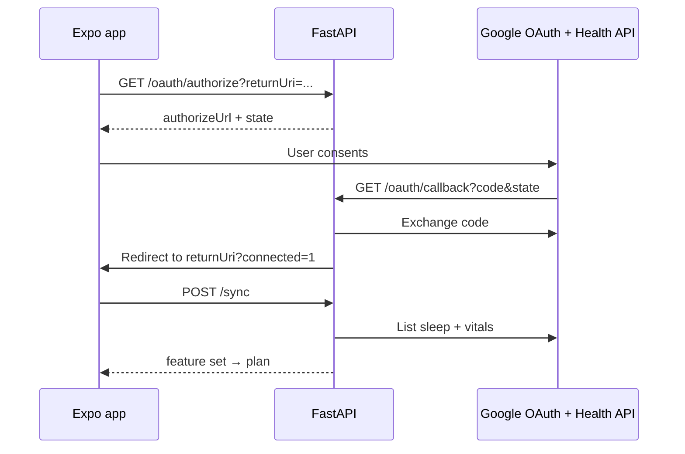

# Google Health

Optional integration with the [Google Health API](https://developers.google.com/health) (Fitbit-backed). SleepSync reads sleep staging and vitals to build feature sets for plan generation. Without a connection, the backend uses a shared mock sleep week.

OAuth runs on the backend. The mobile app never receives the client secret. Refresh tokens are encrypted at rest on the server.

## Data flow

Google registers one redirect URI: the backend callback at `/v1/google-health/oauth/callback`. The app return URI (web path or `sleepsync://` deep link) is only used after the backend stores tokens.

Readonly scopes (see `backend/config.yaml`):

- `https://www.googleapis.com/auth/googlehealth.sleep.readonly`
- `https://www.googleapis.com/auth/googlehealth.health_metrics_and_measurements.readonly`

## What sync pulls

Sleep stages and vitals across the user's bed-to-wake window, binned into 15-minute intervals. Up to seven recent nights are averaged into one feature matrix per plan request.

## Plan inputs

| Source | When used |
|--------|-----------|
| Google Health (≤7 nights) | Connected and sync meets sufficiency thresholds |
| Mock sleep week | Not connected, sync failed, or insufficient data |

**Sufficient** sync requires staged sleep in at least 40% of interval bins and at least 180 minutes total in the pulled window. Otherwise the API returns HTTP 422 and the plan stays on mock data.

Debrief history from the last seven mornings always feeds the optimizer, with or without Google Health.

Response metadata (`sleepDataSource`, `sleepDataReason`) tells the client which path was used.

## API triggers

| Event | Endpoint |
|-------|----------|
| Tonight focus or schedule change while connected | `POST /v1/google-health/sync` |
| Debrief saved while connected | `POST /v1/google-health/outcome-sync` |
| Disconnect | `DELETE /v1/google-health/connection` |

If OAuth credentials are not configured on the backend, authorize returns 503 and plans use mock data.

## Self-hosting

Requires a Google Cloud Web application OAuth client, Health API access, and the variables in `backend/.env.example`. While the consent screen is in Testing, only listed test users can connect. Broader access needs Google's OAuth verification process.
